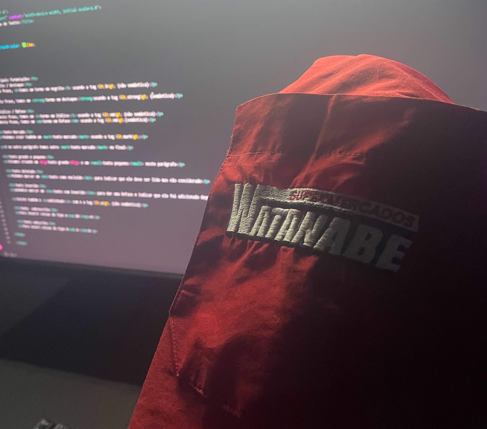

# 🚀 Minha Jornada Dev: Da Prevenção ao Código

Este repositório registra o meu primeiro projeto estruturado de desenvolvimento web. Mais do que um site, ele é o reflexo da minha transição de carreira e da minha dedicação diária.

## 📌 Sobre o Projeto
O projeto foi construído para aplicar conceitos de **HTML5 Semântico** e **CSS3**. Ele apresenta uma galeria visual que narra minha trajetória e um dicionário técnico das tags aprendidas.

### 🛠️ Tecnologias e Conceitos:
* **HTML5 Semântico**: Uso de tags como `<header>`, `<main>`, `<article>` e `<figure>`.
* **CSS3 Moderno**: Layout com Flexbox, Reset de Box-sizing e estilização Dark Mode.
* **Organização Profissional**: Pastas separadas para mídias e código limpo.

## 💻 Workstation & Disciplina
Este código foi escrito em uma workstation que eu mesmo fabriquei, reaproveitando materiais de um antigo guarda-roupa. Atualmente, concilio os estudos (24/43 aulas concluídas) com meu turno de trabalho no varejo, mantendo a constância como pilar principal.

## 📸 Galeria de Evolução
No site, apresento o contraste entre o meu presente (Prevenção de Perdas no Supermercado Watanabe) e o meu objetivo (Desenvolvedor Sênior em uma Big Tech).

---
*Desenvolvido com ☕ e foco por Kayo Martins*
